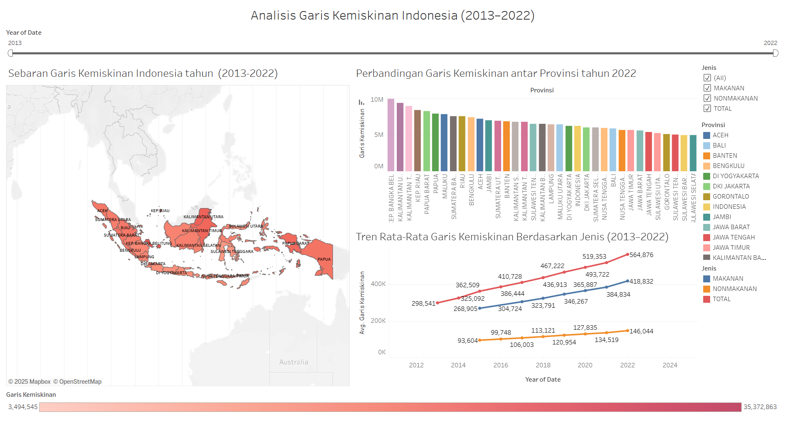

# Analisis Garis Kemiskinan Indonesia (2013–2022)
📊 Proyek ini menganalisis data garis kemiskinan dari BPS berdasarkan provinsi, jenis kebutuhan, dan daerah. Visualisasi dilakukan dengan Tableau untuk memahami tren dan distribusi.

## 🎯 Tujuan
- Mengetahui tren garis kemiskinan dari waktu ke waktu
- Menganalisis kontribusi masing-masing provinsi terhadap total kemiskinan nasional
- Membandingkan kategori (makanan vs non-makanan)

## 🛠 Tools
- Excel (pembersihan data)
- Tableau (visualisasi)
- GitHub (dokumentasi)

## 📈 Dashboard Preview

## 🧠 Insight Utama
- Garis kemiskinan cenderung meningkat dari 2015 hingga 2020, kemudian menurun perlahan.
- Provinsi dengan kontribusi terbesar terhadap garis kemiskinan nasional adalah [Provinsi Kepulauan Bangka Belitung].
- Kategori "Makanan" mendominasi garis kemiskinan.

## 📂 File
- `/data/Garis Kemiskinan Indonesia (Cleanning).xlsx`
- `/dashboard/Garis Kemiskinan Indonesia 2013-2022.twbx`